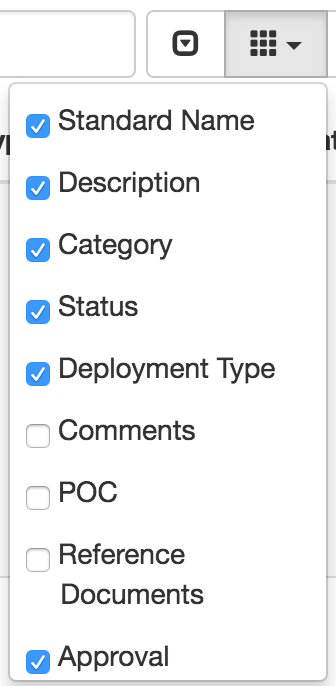
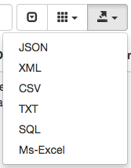

# GSA Enterprise Architecture

> The Enterprise Architecture, Policy and Planning Division provides business-focused IT support for GSA customers at all levels of the organization.

The General Services Administration's [Enterprise Architecture](http://www.gsa.gov/portal/category/26815) team maintains a list of systems approved for use at GSA, called the [IT Standards Profile list](it-standards.csv). This list includes:

* Desktop software
* Server software
* Software as a Service (SaaS)

Make sure to **pay attention to the `Status` column**, as the list includes items that are `Approved`, `Pending`, and `Denied` (though there can be other values for the column).

The data is manually exported (for now), though we will try to update it regularly. See the Last Modified date on the CSV to see when it was last updated. Feel free to [open an issue](https://github.com/GSA/data/issues/new) to give us a nudge if we forget!

## Updating the list

*Only applicable to GSA staff.*

1. Visit [the canonical IT Standards list](https://ea.gsa.gov/EAWEB/#!/itstandards) (you need to be on the GSA network—see [VPN information](https://handbook.18f.gov/anyconnect/)).
1. Only show the `Standard Name`, `Description`, `Category`, `Status`, `Deployment Type`, and `Approval Expiration Date` columns.

    

1. Export the list as a CSV.

    

1. Replace [`it-standards.csv`](it-standards.csv).
